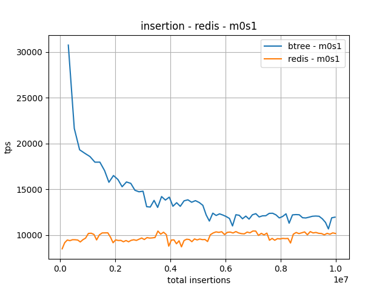
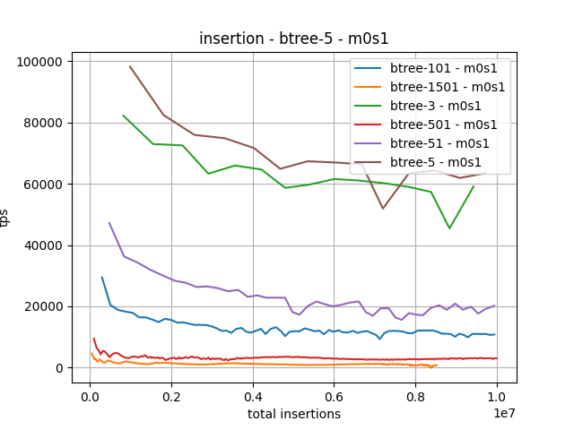

# Intro

This is a my personal research about how to implement and use B-tree. Not that world needs more b-trees implementions, just it turned out to be fun.
To make research somewhat close to real life tasks here is leader board problem.

# Leader board problem
Leader board service receives network requests with information about users's recent earned points. The service must add these points to users's score and returns his current position in leader board and 10 his neighbours above and below.

Example:

request:
```
 {
     "user": "Bob"
     "points": 12.24125
 }
```

Assuming Bob earned 100 points before here is an example response

```
response:
 [
     ...
     { "user": "John", "points": 112.54, "position": 32},
     { "user": "Kate", "points": 112.34, "position": 33},
     { "user": "Bob", "points": 112.24125, "position": 34},
     { "user": "Daniel", "points": 112.24125, "position": 35},
     { "user": "Lilly", "points": 112.22, "position": 36},
     ...
 ]
```

Note that Bob & Daniel have identical number of points. As Bob earned 112.24125 most recently, so he goes above Daniel. 

# Current status

Implemented:
- b-tree implemented (no concurrent support yet)
- benchmark code is written for:
 - measuring insertions rates
 - comparing insertion with heap structure
 - comparing insertion with Redis

- for measuring the whole service the yandex tank tool is used
  - currently it's no able to 10k rps load

TODO:
- implement correct response:
 - add position
 - show neighbours

- fix locking for concurrent insertions
- implement benchmark code for:
  - measuring upsert after b-tree already has 10 millions of items

# Latest perfomance measure

For more detailed information, how perfomance is measured go to [test/README.md](test/README.md)

Here is insertion rate comparison with Redis




As b-tree can have multiple values in one leaf, here is comparsion for different b-tree configurations. Turned out that the more values you have in one leaf, the slower is b-tree. This needs more thorough research why it's like that.

